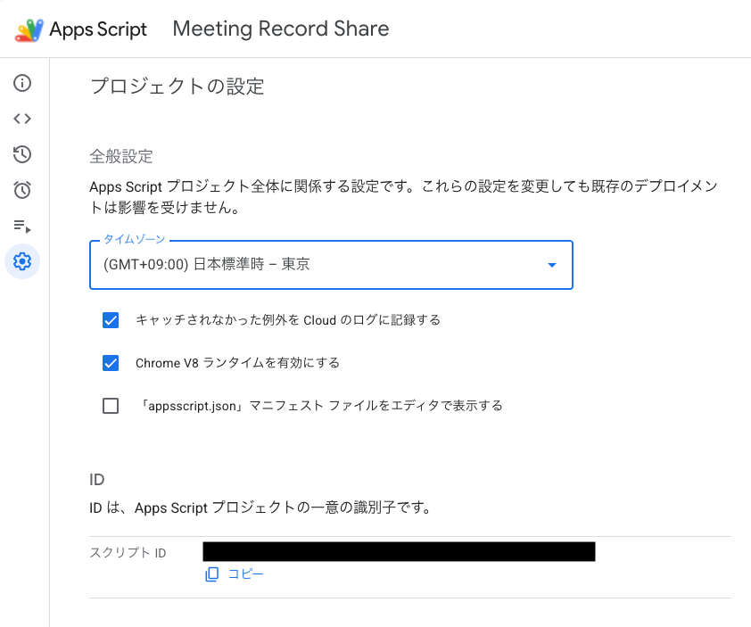
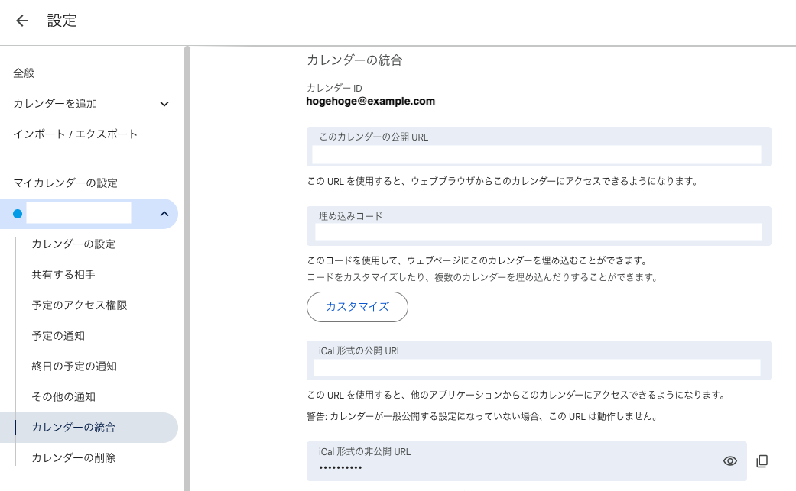
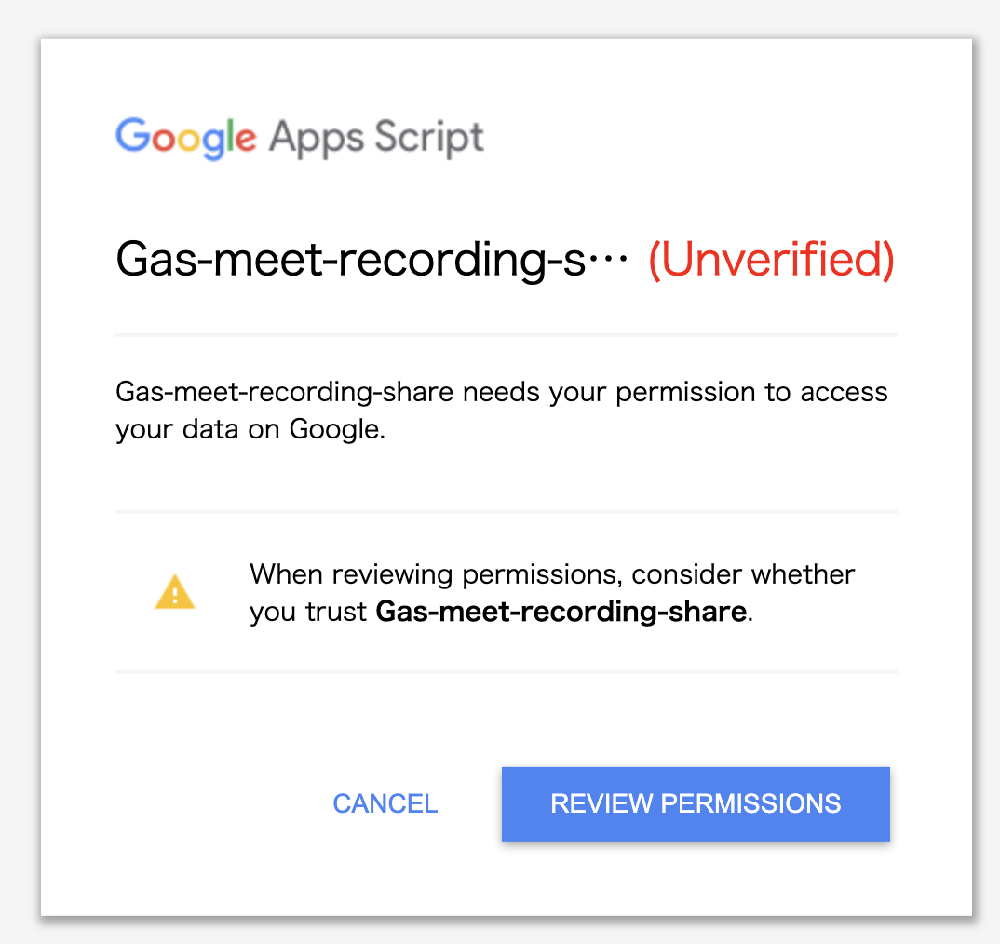
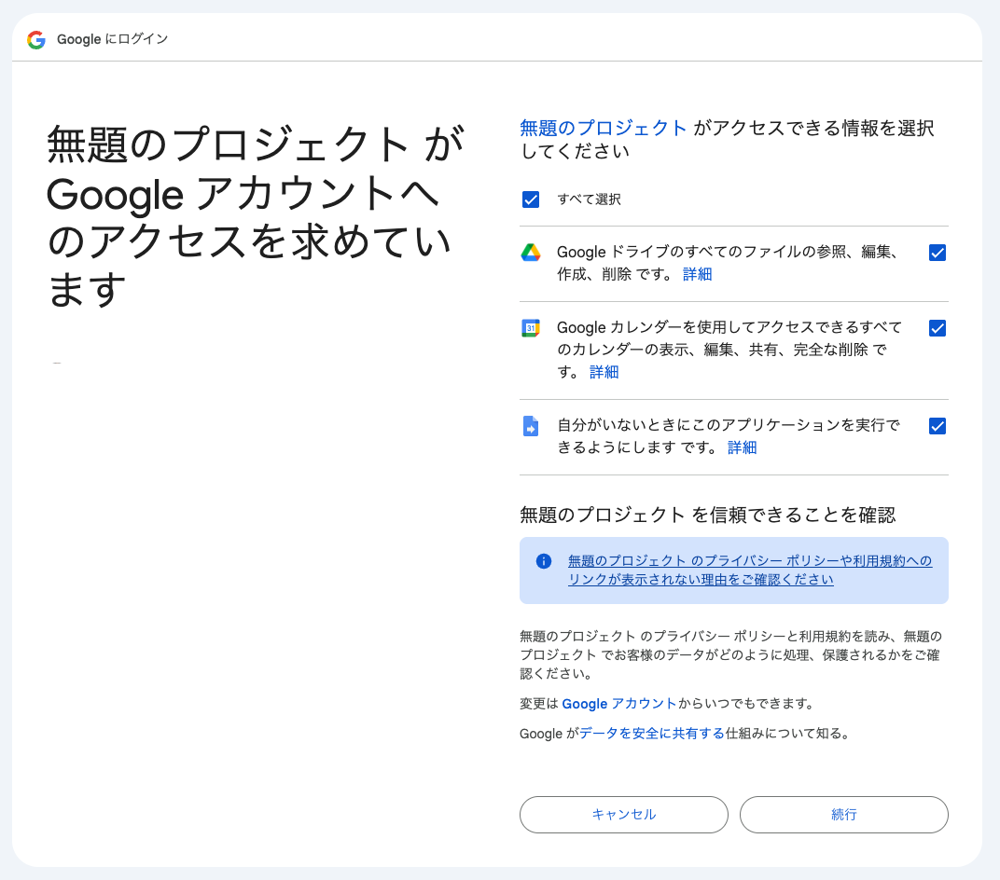
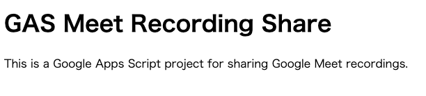

# Meet Recording Share

- Google Meetの録画を参加者に自動的に共有
  - 条件
    - 指定したカレンダー
    - かつ
    - 指定したユーザーがオーナーの予定
    - かつ
    - 終了時刻が直近2日以内
  - トリガー
    - カレンダーが更新された時
    - 毎日0:00 ~ 2:00くらい
      - 前回トリガーからの差分が全て取れるため件数多くさせない対策
        - 条件で2日以上前は除外
        - 取りこぼさないように定期的に同期
- 設定用APIを一時的にインストール時に公開するため下記の安全対策を実施
  - 自分以外アクセス不可
  - インストール作業完了後、APIは非公開化

> [!WARNING]
> 本ツールで発生したいかなる損害も作者は責任を負いません。自己判断で使用してください。

# 必要なツール

bash互換シェル、jq、awk、grep

```
brew install jq
```

# Install

## GASプロジェクトの作成

空のGASプロジェクトを事前に作成してスクリプトIDをコピー



## カレンダーIDの取得

処理対象のカレンダーIDを取得



## 設定ファイルの作成

.envにはこれまでに取得したカレンダーIDと対象のオーナーメールアドレスを記入

```
cp example.env .env
nano .env
```

.clasp.jsonにはこれまでに取得したスクリプトIDを記入

```
cp example.clasp.json .clasp.json
nano .clasp.json
```

## デプロイ & 初期設定

```
npm i
npm run login
npm run push
npm run deploy # 設定用APIの公開
npm run open-webapp # Googleサービスの認可画面を出す
npm run configure # 初期設定実施
npm run undeploy # 設定用APIを非公開
```

> [!NOTE]
> `npm run push`を実行した時に`Manifest file has been updated. Do you want to push and overwrite?`と表示されることがあります。`y`を入力して続行してください。
>
> 

> [!NOTE]
> `npm run open-webapp`を実行した時にブラウザーが開きます。認可されているスコープが不十分の場合、認可画面が表示されます。
> `REVIEW PERMISSIONS`をクリックして次に進んでください。
>
> 
>
> 全てにチェックを入れて、同意してください。
>
> 
>
> 正常に認可されると下記の画面が表示されます。ブラウザを閉じて次の手順に進んでください。
>
> 
